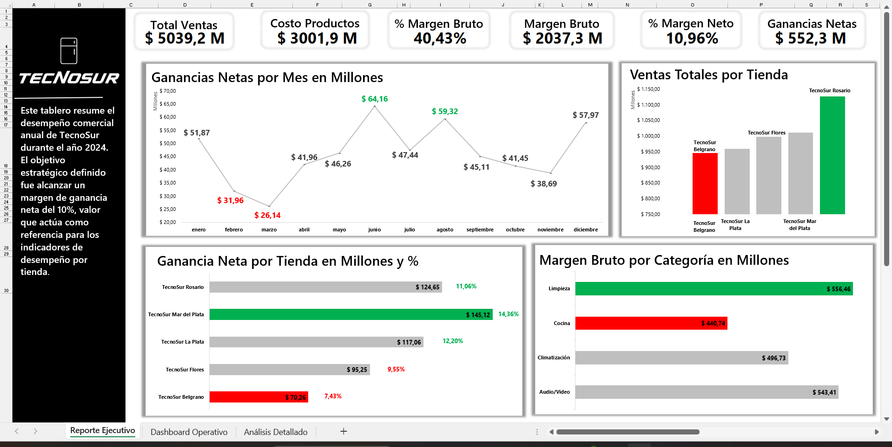
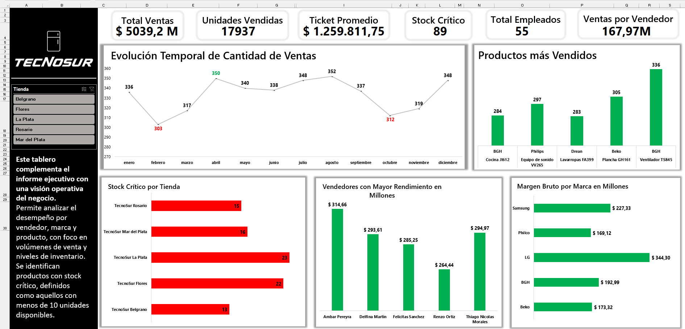
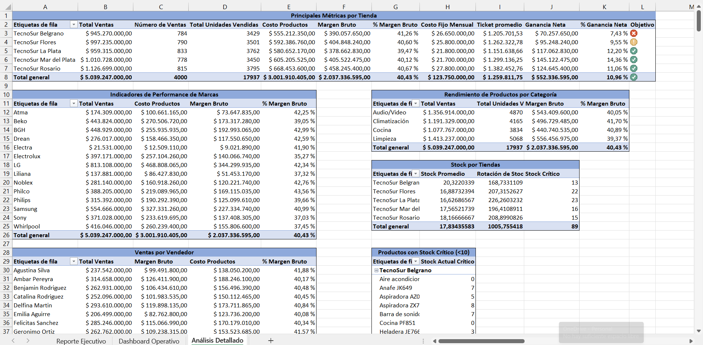

# 🧾 TecnoSur – Dashboard Ejecutivo y Operativo (2024)

Este proyecto simula el análisis comercial integral de **TecnoSur**, una cadena ficticia de tiendas de tecnología que opera en diversas provincias argentinas, enfocada en brindar soluciones tecnológicas con variedad de productos y atención personalizada.  

El objetivo principal fue demostrar que se pueden lograr análisis completos y visualmente impactantes utilizando **solo Excel como herramienta de reporte** y modelado, apoyado en una generación de datos sintéticos automatizada con Python.

---

## 🚀 Descripción del proyecto

El flujo de trabajo fue el siguiente:

1. **Generación de datos sintéticos** mediante scripts en Python, usando librerías como *faker*, *numpy* y *pandas* para simular escenarios realistas.  
2. **Transformación y carga de los datos CSV a Excel** utilizando Power Query.  
3. **Modelado de datos relacional** en Power Pivot.  
4. **Creación de medidas DAX** para análisis de KPIs.  
5. **Diseño de dos dashboards**:  
   - 🧠 **Reporte Ejecutivo** con foco estratégico.  
   - 🛠️ **Dashboard Operativo** con foco en rendimiento y stock.  
6. Incorporación de una hoja de **Análisis Detallado** con tablas dinámicas clave.  

Esta combinación permite automatizar la generación de datos y explotar al máximo las capacidades de modelado y visualización de Excel.

---

## 🛠️ Herramientas utilizadas

- Python (pandas, numpy, faker)  
- Power Query  
- Power Pivot  
- DAX  
- Excel  

---

## 📁 Archivos del repositorio

| Archivo | Descripción |
|--------|-------------|
| [`Generación tabla costos_fijos - Tecnosur.py`](./Generación%20tabla%20costos_fijos%20-%20Tecnosur.py) | Script en Python que genera el CSV de costos fijos por tienda. |
| [`Generación tabla empleados - Tecnosur.py`](./Generación%20tabla%20empleados%20-%20Tecnosur.py) | Genera los empleados distribuidos por tienda y turno. |
| [`Generación tabla inventario - Tecnosur.py`](./Generación%20tabla%20inventario%20-%20Tecnosur.py) | Crea el inventario inicial de productos por tienda. |
| [`Generación tabla productos - Tecnosur.py`](./Generación%20tabla%20productos%20-%20Tecnosur.py) | Genera la lista de productos, con categoría, marca y precio unitario. |
| [`Generación tabla tiendas - Tecnosur.py`](./Generación%20tabla%20tiendas%20-%20Tecnosur.py) | Crea las 5 tiendas según el nuevo modelo de sucursales. |
| [`Generación tabla ventas - Tecnosur.py`](./Generación%20tabla%20ventas%20-%20Tecnosur.py) | Simula las ventas de todo el año, con fecha, producto, tienda, vendedor y unidades. |

---

| Archivo | Descripción |
|--------|-------------|
| [`costos_fijos_tecnosur.csv`](./costos_fijos_tecnosur.csv) | Costos fijos mensuales por tienda. |
| [`empleados_tecno_sur.csv`](./empleados_tecno_sur.csv) | Lista de empleados, con asignación por tienda y turno. |
| [`inventario_tecno_sur.csv`](./inventario_tecno_sur.csv) | Stock inicial por producto y tienda. |
| [`productos_tecno_sur.csv`](./productos_tecno_sur.csv) | Catálogo de productos con marca, categoría y precio. |
| [`tiendas_tecno_sur.csv`](./tiendas_tecno_sur.csv) | Datos de las 5 tiendas de TecnoSur. |
| [`ventas_tecno_sur.csv`](./ventas_tecno_sur.csv) | Registro detallado de ventas realizadas durante 2024. |

---

| Archivo | Descripción |
|--------|-------------|
| [`Tecnosur_Reporte.xlsx`](./Tecnosur_Reporte.xlsx) | Archivo principal con modelo de datos, medidas DAX, Power Pivot y dashboards listos para análisis. |

---

## 📷 Capturas

### Reporte Ejecutivo  
> KPIs estratégicos, márgenes, ganancias netas, cumplimiento de objetivos.  
  

### Dashboard Operativo  
> Análisis por vendedor, producto, stock crítico y evolución de ventas.  
  

### Análisis Detallado  
> Tablas dinámicas clave para seguimiento granular y exploración de datos.  
  

---

## 🎯 Objetivos del análisis

- Evaluar el desempeño comercial de cada tienda.  
- Identificar vendedores, productos y marcas con mayor rendimiento.  
- Detectar productos con **stock crítico** (menos de 10 unidades).  
- Facilitar la toma de decisiones estratégicas y operativas.  

El proyecto busca aportar insights clave para la toma de decisiones basadas en datos sintéticos confiables y mostrar el potencial analítico que se puede alcanzar utilizando Excel como herramienta central.

---

## 🔗 Ver más trabajos

Mi trabajo completo puede verse en mi portfolio personal: [https://leoneltoro.github.io/](https://leoneltoro.github.io/)

# 🧾 TecnoSur – Executive and Operational Dashboard (2024)

This project simulates the comprehensive commercial analysis of **TecnoSur**, a fictional chain of technology stores operating in various Argentine provinces, focused on providing technological solutions with a wide range of products and personalized service.

The main objective was to demonstrate that complete and visually impactful analyses can be achieved using **Excel alone as the reporting and modeling tool**, supported by automated synthetic data generation with Python.

---

## 🚀 Project Description

The workflow was as follows:

1. **Synthetic data generation** through Python scripts, using libraries such as *faker*, *numpy*, and *pandas* to simulate realistic scenarios.  
2. **Transformation and loading of CSV data into Excel** using Power Query.  
3. **Relational data modeling** in Power Pivot.  
4. **Creation of DAX measures** for KPI analysis.  
5. **Design of two dashboards**:  
   - 🧠 **Executive Report** with a strategic focus.  
   - 🛠️ **Operational Dashboard** focusing on performance and stock.  
6. Inclusion of a **Detailed Analysis** sheet with key pivot tables.  

This combination allows automating data generation and fully leveraging Excel’s modeling and visualization capabilities.

---

## 🛠️ Tools Used

- Python (pandas, numpy, faker)  
- Power Query  
- Power Pivot  
- DAX  
- Excel  

---

## 📁 Repository Files

| File | Description |
|--------|-------------|
| [`Generación tabla costos_fijos - Tecnosur.py`](./Generación%20tabla%20costos_fijos%20-%20Tecnosur.py) | Python script generating the fixed costs CSV per store. |
| [`Generación tabla empleados - Tecnosur.py`](./Generación%20tabla%20empleados%20-%20Tecnosur.py) | Generates employees distributed by store and shift. |
| [`Generación tabla inventario - Tecnosur.py`](./Generación%20tabla%20inventario%20-%20Tecnosur.py) | Creates the initial inventory of products per store. |
| [`Generación tabla productos - Tecnosur.py`](./Generación%20tabla%20productos%20-%20Tecnosur.py) | Generates the product list, including category, brand, and unit price. |
| [`Generación tabla tiendas - Tecnosur.py`](./Generación%20tabla%20tiendas%20-%20Tecnosur.py) | Creates the 5 stores according to the new branch model. |
| [`Generación tabla ventas - Tecnosur.py`](./Generación%20tabla%20ventas%20-%20Tecnosur.py) | Simulates sales for the entire year, including date, product, store, seller, and units. |

---

| File | Description |
|--------|-------------|
| [`costos_fijos_tecnosur.csv`](./costos_fijos_tecnosur.csv) | Monthly fixed costs per store. |
| [`empleados_tecno_sur.csv`](./empleados_tecno_sur.csv) | Employee list with assignment by store and shift. |
| [`inventario_tecno_sur.csv`](./inventario_tecno_sur.csv) | Initial stock by product and store. |
| [`productos_tecno_sur.csv`](./productos_tecno_sur.csv) | Product catalog with brand, category, and price. |
| [`tiendas_tecno_sur.csv`](./tiendas_tecno_sur.csv) | Data of the 5 TecnoSur stores. |
| [`ventas_tecno_sur.csv`](./ventas_tecno_sur.csv) | Detailed record of sales made during 2024. |

---

| File | Description |
|--------|-------------|
| [`Tecnosur_Reporte.xlsx`](./Tecnosur_Reporte.xlsx) | Main file with data model, DAX measures, Power Pivot, and dashboards ready for analysis. |

---

## 📷 Screenshots

### Executive Report  
> Strategic KPIs, margins, net profits, goal fulfillment.  
  

### Operational Dashboard  
> Analysis by seller, product, critical stock, and sales evolution.  
  

### Detailed Analysis  
> Key pivot tables for granular monitoring and data exploration.  
  

---

## 🎯 Analysis Objectives

- Evaluate the commercial performance of each store.  
- Identify top-performing sellers, products, and brands.  
- Detect products with **critical stock** (less than 10 units).  
- Facilitate strategic and operational decision-making.  

The project aims to provide key insights for decision-making based on reliable synthetic data and demonstrate the analytical potential achievable using Excel as the central tool.

---

## 📌 Status

✅ Project completed and ready for portfolio presentation.

---

## 🔗 See More Work

My complete work can be viewed on my personal portfolio: [https://leoneltoro.github.io/](https://leoneltoro.github.io/)

